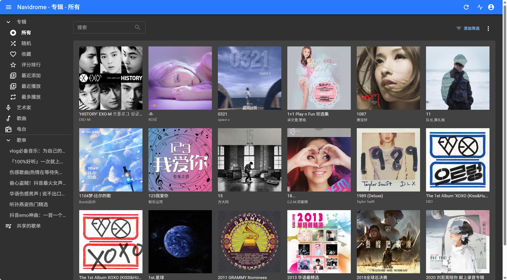

# 🎵 Song Station | 私有音乐库搭建系统

<p align="center">
  
</p>

<p align="center">
  <a href="#功能特性">功能特性</a> •
  <a href="#快速开始">快速开始</a> •
  <a href="#使用指南">使用指南</a> •
  <a href="#docker部署">Docker部署</a> •
  <a href="#项目结构">项目结构</a>
</p>

---

## ✨ 功能特性

### 🎧 音乐搜索与下载
- [x] **多平台支持**：网易云音乐、QQ音乐、酷狗音乐、酷我音乐
- [x] **多种音质选择**：标准品质、高品质、无损品质(FLAC)
- [x] **批量下载**：支持歌单链接批量解析下载
- [x] **智能匹配**：根据歌名-歌手自动匹配最优音质

### 📝 元数据管理
- [x] **ID3标签嵌入**：自动写入歌曲标题、艺术家、专辑信息
- [x] **专辑封面**：自动下载并嵌入高清专辑封面
- [x] **双语歌词**：支持LRC格式歌词及翻译内嵌
- [x] **智能路径**：自动按 `艺术家/专辑/歌曲名` 结构整理

### 📱 用户体验
- [x] **响应式设计**：完美适配桌面端和移动端
- [x] **在线预览**：支持歌曲在线播放试听
- [x] **下载进度**：实时显示下载进度和日志
- [x] **Cookie管理**：可视化配置音乐平台Cookie

### 🎵 歌单功能
- [x] **排行榜浏览**：支持各大平台热门榜单
- [x] **M3U歌单生成**：自动生成Navidrome兼容歌单
- [x] **播放列表**：本地播放队列管理

---

## 🚀 快速开始

### 环境要求

| 项目 | 版本要求 |
|------|----------|
| Python | 3.11+ |
| 数据库 | SQLite / MySQL |
| 系统 | Windows / macOS / Linux |

### 本地部署

1. **克隆项目**
```bash
git clone <repository-url>
cd music2.0
```

2. **安装依赖**
```bash
pip3 install -r requirements.txt
```

3. **配置数据库（可选）**

默认使用SQLite，如需使用MySQL，修改 `config.py`：
```python
class DevelopmentConfig(Config):
    DEBUG = True
    SQLALCHEMY_DATABASE_URI = 'mysql+pymysql://用户名:密码@localhost/数据库名'
```

4. **启动服务**
```bash
python3 app.py
```

5. **访问应用**
打开浏览器访问 http://localhost:5000

---

## 🐳 Docker部署

### 使用 Docker Compose（推荐）

```yaml
version: '3'

services:
  music-station:
    image: crpi-g2vqp6cspcljbor7.cn-hangzhou.personal.cr.aliyuncs.com/leechee_ii/musicdownload:latest
    container_name: music-station
    restart: always
    ports:
      - "5000:5000"
    volumes:
      - /path/to/downloads:/app/downloads    # 音乐下载目录
      - /path/to/log:/app/log                # 日志目录
    environment:
      - EVN=production
      - DATABASE_URL=sqlite:///music.db      # 或 MySQL 连接串
```

启动命令：
```bash
docker-compose up -d
```

### 使用 Docker Run

```bash
docker run -d \
  -p 5000:5000 \
  --restart always \
  -v /path/to/downloads:/app/downloads \
  -v /path/to/log:/app/log \
  -e EVN=production \
  -e DATABASE_URL=sqlite:///music.db \
  --name music-station \
  crpi-g2vqp6cspcljbor7.cn-hangzhou.personal.cr.aliyuncs.com/leechee_ii/musicdownload:latest
```

---

## 📖 使用指南

### 1. 配置Cookie

首次使用需要配置音乐平台的Cookie：

1. 点击页面右上角设置按钮
2. 粘贴对应平台的Cookie（从浏览器开发者工具中获取）
3. 保存配置

### 2. 搜索歌曲

在搜索框输入歌曲名、歌手或专辑，选择平台后点击搜索。


### 3. 下载歌曲

**桌面端**：点击下载按钮，在下拉菜单中选择音质

**移动端**：点击下载按钮，选择需要的音质格式

### 4. 下载歌单

1. 进入下载管理页面（点击右上角下载图标）
2. 粘贴歌单链接（支持网易云、QQ音乐歌单）
3. 选择音质后点击开始下载

### 5. 在线试听

点击歌曲封面或名称即可在线播放试听。

---

## 🏗️ 项目结构

```
music2.0/
├── app.py                  # Flask应用入口
├── config.py               # 配置文件
├── requirements.txt        # Python依赖
├── docker-compose.yml      # Docker Compose配置
├── Dockerfile              # Docker镜像构建
│
├── routers/                # 路由模块
│   ├── search_router.py    # 搜索接口
│   ├── download_routes.py  # 下载接口
│   ├── top_list_router.py  # 排行榜接口
│   ├── api_router.py       # API接口
│   └── ...
│
├── server/                 # 业务逻辑层
│   ├── search_server.py    # 搜索服务
│   └── download_server.py  # 下载服务
│
├── utils/                  # 工具模块
│   ├── wyyMusic_parse_util.py   # 网易云解析
│   ├── qqMusic_parse_util.py    # QQ音乐解析
│   ├── download_util.py         # 下载工具
│   ├── mutagen_util.py          # 元数据编辑
│   └── ...
│
├── entity/                 # 数据实体
│   ├── song_entity.py
│   └── song_download_entity.py
│
├── static/                 # 静态资源
│   ├── css/               # 样式文件
│   ├── js/                # JavaScript文件
│   └── images/            # 图片资源
│
├── templates/              # HTML模板
│   ├── index.html         # 主页面
│   └── download.html      # 下载页面
│
└── log/                    # 日志目录
```

---

## 🔧 技术栈

- **后端**：Flask + Flask-SocketIO + Flask-SQLAlchemy
- **前端**：Vue.js + Element UI
- **数据库**：SQLite / MySQL
- **部署**：Docker + Docker Compose

---

## 📋 功能路线图

### 已实现 ✅
- [x] 多平台音乐搜索（网易云、QQ音乐、酷狗、酷我）
- [x] 多种音质下载（标准、高品质、无损FLAC）
- [x] 智能元数据嵌入（ID3v2标准）
- [x] 专辑封面和双语歌词内嵌
- [x] 自动路径生成和整理
- [x] M3U歌单生成
- [x] Docker一键部署
- [x] 移动端适配
- [x] 在线预览播放

### 计划中 📅
- [ ] 本地下载功能优化
- [ ] 排行榜分页加载更多
- [ ] Jellyfin歌单生成支持
- [ ] 网易云搜索分页功能
- [ ] 用户系统与下载历史

---

## 🤝 参与贡献

欢迎通过以下方式参与项目：

1. **提交Issue**：报告Bug或提出功能建议
2. **提交PR**：Fork仓库后进行改进并提交合并请求
3. **补充平台**：适配更多音乐平台API

### 贡献指南

1. Fork本仓库
2. 创建特性分支 (`git checkout -b feature/AmazingFeature`)
3. 提交更改 (`git commit -m 'Add some AmazingFeature'`)
4. 推送到分支 (`git push origin feature/AmazingFeature`)
5. 创建Pull Request

---

## 📜 免责声明

**支持正版音乐！**

本项目仅供学习交流使用，所有音乐资源版权归原平台所有。请在使用后24小时内删除下载的内容，并支持正版音乐。

本项目汇聚GitHub上各位大牛提供的方法，仅用于技术研究，请勿用于商业用途。

---

## 📄 开源协议

本项目基于 [MIT License](LICENSE) 开源。

---

## ☕ 支持作者

如果觉得这个项目对你有帮助，欢迎给个 Star ⭐

<p align="center">
  <b>Made with ❤️ by LeeChee</b>
</p>
